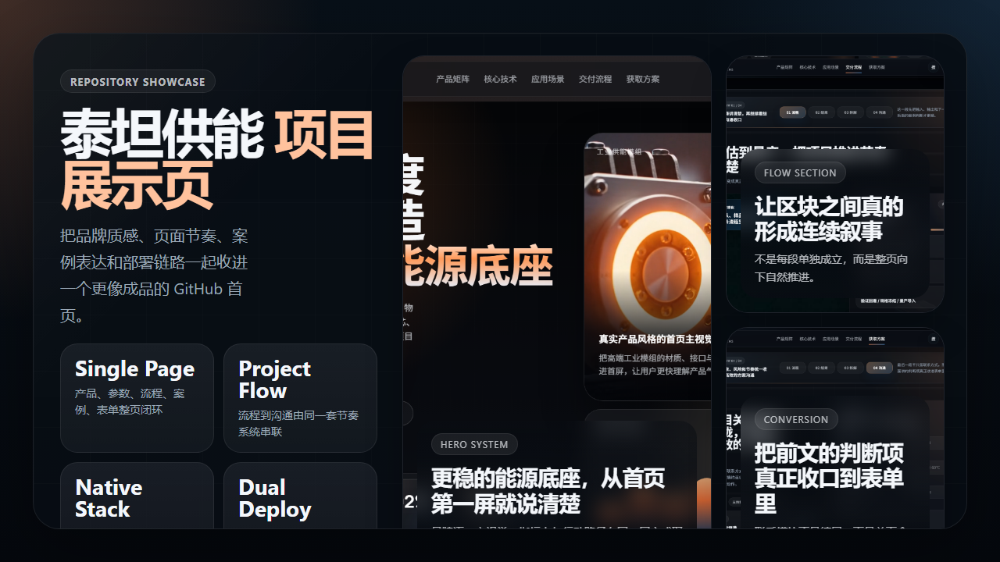
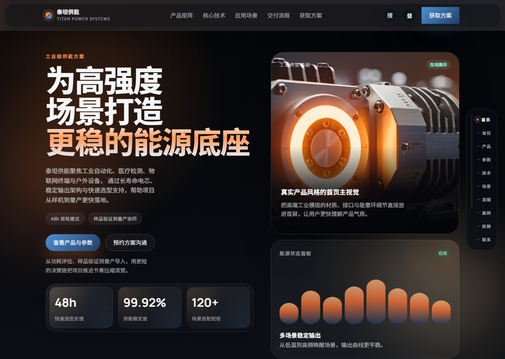
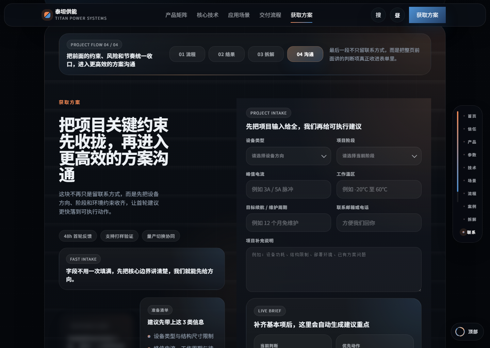
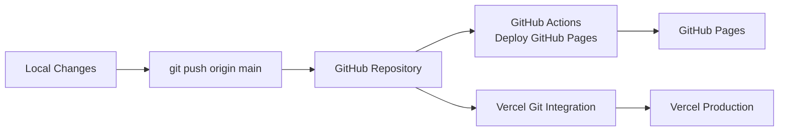

# 泰坦供能

<p align="center">
  
  
  
  
</p>

> 一个面向工业自动化、医疗检测、物联网终端与户外设备的工业级供能方案展示站点。  
> 重点不只是“把页面做出来”，而是把品牌气质、区块节奏、案例叙事和表单转化一起收进一套完整表达。

<p align="center">
  <a href="https://titan-energy-site.vercel.app"><strong>生产环境</strong></a>
  ·
  <a href="https://xxwl12122.github.io/titan-energy-site/"><strong>GitHub Pages</strong></a>
  ·
  <a href="https://github.com/xxwl12122/titan-energy-site"><strong>GitHub 仓库</strong></a>
</p>

<p align="center">
  
</p>

## 快速概览

| 维度 | 内容 |
| --- | --- |
| 品牌名称 | `泰坦供能 / TITAN POWER SYSTEMS` |
| 项目类型 | 工业级供能方案单页品牌站 |
| 技术栈 | 原生 `HTML + CSS + JavaScript` |
| 核心升级 | 统一中后段页面节奏、强化品牌命名、升级仓库首页展示 |
| 线上访问 | Vercel 主站 + GitHub Pages 镜像 |

## 项目定位

这个仓库承载的是一个完整的工业品牌展示站点，重点不是复杂工程化，而是把下列事情在原生前端里做扎实：

- 让首页第一屏就有明确的工业产品气质和品牌辨识度
- 让中后段区块不是“单段好看”，而是能作为同一套设计系统自然推进
- 让案例、流程、拆解和联系表单形成连续叙事，而不是彼此割裂
- 让部署链路简单稳定，推送到 `main` 就能同步到 Vercel 和 GitHub Pages

## 页面预览

| 首页主视觉 | 流程与节奏 | 沟通与转化 |
| --- | --- | --- |
|  |  |  |

## 这次项目重点

| 方向 | 当前实现 |
| --- | --- |
| 品牌命名 | 统一为 `泰坦供能 / TITAN POWER SYSTEMS` |
| 视觉语言 | 深色工业底、橙蓝对比、高密度卡片、玻璃感面板和渐变光带 |
| 页面节奏 | `流程 → 结果 → 拆解 → 沟通` 通过统一的 `Project Flow` 阶段条串联 |
| 信息结构 | 产品矩阵、参数概览、技术、场景、流程、案例、表单全部在单页内闭环 |
| 表单体验 | 自定义下拉、项目摘要生成、输入完成度、邮件草稿复制 |
| 双部署 | Vercel 主站 + GitHub Pages 镜像页 |

## 页面模块拆解

| 区块 | 作用 | 关键内容 |
| --- | --- | --- |
| Hero | 建立品牌第一印象 | 视频主视觉、品牌语、核心指标、主 CTA |
| Trust / Product / Parameters | 建立可信度和产品基础认知 | 行业覆盖、产品矩阵、参数能力 |
| Technology / Scenarios | 解释为什么这个方案成立 | 核心技术、典型应用环境 |
| Process | 把项目推进方式讲清楚 | Project Board、阶段流程、输入输出关系 |
| Proof | 把抽象能力翻译成项目结果 | 典型案例、推进节点、结果表达 |
| Case Detail | 把案例继续往可执行动作层拆解 | 背景约束、判断逻辑、验证动作、建议包 |
| Contact | 收口整页信息并触发表单沟通 | Fast Intake、Response Flow、项目输入表单 |
| Footer / 404 | 补齐站点闭环 | 次级 CTA、联系支持、兜底页面 |

## 设计系统摘要

| 维度 | 说明 |
| --- | --- |
| 品牌基调 | 偏高端工业设备感，强调稳定、精密、耐用、项目推进效率 |
| 主色 | `#ef8753` 橙色负责温度和能量感，`#4d90d2` 蓝色负责系统感与工程感 |
| 字体策略 | `Manrope` 负责标题张力，`Noto Sans SC` 负责中文正文稳定性 |
| 组件母题 | 大圆角面板、胶囊标签、数据卡片、流程节点、浅玻璃层和局部光带 |
| 节奏策略 | 大标题段落和高密度卡片交替，避免连续同构造成疲劳 |
| 移动端原则 | 保留信息密度，但重排层级，确保关键流程和 CTA 仍然完整可见 |

## 交互清单

| 交互 | 说明 |
| --- | --- |
| 站内搜索 | 关键词直达核心区块 |
| 章节导览 | 右侧 Rail 随滚动高亮当前区块 |
| 主题切换 | 支持亮暗主题切换 |
| Reveal 动画 | 区块进入时带有节奏化显现 |
| 数字动效 | 首页指标数值递增 |
| 自定义 Select | 表单字段使用自定义下拉样式 |
| 项目摘要生成 | 根据表单输入生成当前判断与优先动作 |
| 移动快捷入口 | 底部悬浮 CTA 保证窄屏转化入口 |

## 仓库结构

| 路径 | 职责 |
| --- | --- |
| `index.html` | 页面结构、SEO 元信息、主要文案和区块顺序 |
| `assets/styles/main.css` | 全站视觉系统、组件样式、响应式和动画规则 |
| `assets/scripts/main.js` | 搜索、滚动、主题、表单、动态摘要、状态同步 |
| `assets/images/` | 产品图、场景图、分享图和 README 预览图 |
| `404.html` | 独立 404 页面 |
| `vercel.json` | Vercel 部署配置 |
| `.github/workflows/deploy-pages.yml` | GitHub Pages 自动部署工作流 |

<details>
<summary><strong>目录速览</strong></summary>

```text
.
├─ index.html
├─ 404.html
├─ robots.txt
├─ sitemap.xml
├─ vercel.json
├─ assets
│  ├─ images
│  │  ├─ share-cover.png
│  │  ├─ readme-showcase.png
│  │  ├─ readme-hero.png
│  │  ├─ readme-flow.png
│  │  └─ readme-contact.png
│  ├─ scripts
│  │  └─ main.js
│  └─ styles
│     └─ main.css
└─ .github
   └─ workflows
      └─ deploy-pages.yml
```

</details>

## 本地预览

这个项目没有打包步骤，直接作为静态站点运行即可。

```bash
python -m http.server 4173
```

启动后访问 [http://127.0.0.1:4173](http://127.0.0.1:4173)。

## 部署链路



## 自动部署说明

### Vercel

- 项目已绑定 Vercel
- 推送到 `main` 后会自动更新生产环境
- 也可以本地直接执行：

```bash
vercel --prod
```

### GitHub Pages

仓库内置 `deploy-pages.yml`，在 `main` 分支 push 后会自动：

1. 检出仓库代码
2. 组装静态发布目录 `dist`
3. 上传 Pages Artifact
4. 发布到 GitHub Pages

## 当前仓库适合继续往上做的方向

- 增加 Lighthouse、SEO 或可用性结果截图，让仓库展示更完整
- 补一份品牌规范页，单独说明色板、按钮、间距、标题体系和卡片系统
- 给 README 增加更多局部模块截图，例如参数区、案例区和移动端效果
- 如果后面要继续演进，可以再补 CMS 化或内容配置化能力
